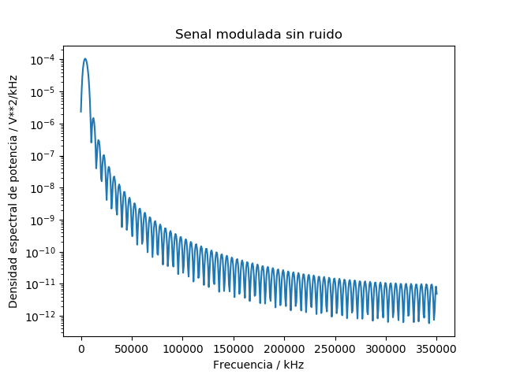
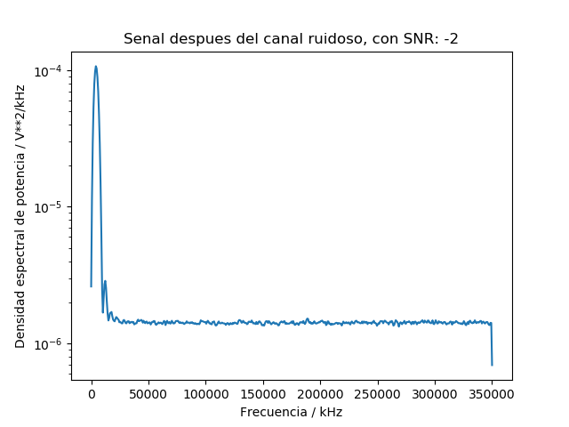
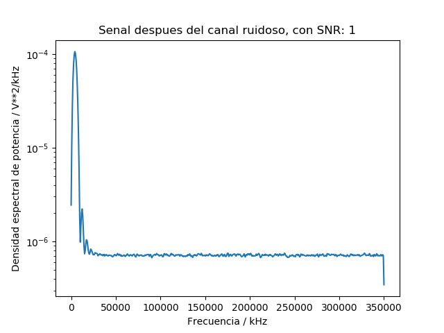

# Tarea 3
#### Por: Marco Chacon Soto B6168
## Dependencias

Se requiere tener instalado un compilador para python o python3

## Compilar y ejecutar

Para correr el programa basta con escribir en consola:

```c
python3 tarea4.py
```

## Descripcion del programa

El programa recibe 3 parametros:
1. Numero de bits: esta cantidad corresponde al numero de bits a leer del archivo bits10k.csv y hace a todas las funciones parametrizables.
2. SNR lower limit: corresponde al numero de dB que se tomara como limite inferior del SNR.
2. SNR upper limit: corresponde al numero de dB que se tomara como limite superior del SNR.

En este codigo se obtienen modulaciones digitales para "transmitir" los datos del archivo bits10k.csv por un canal ruidoso. La modulación se hace con una frecuencia en la portadora de f = 5000 Hz y con un período de símbolo igual a un período completo de la onda portadora.


## Informacion adicional

### Problema 1

Se realiza la modulación por desplazamiento de fase (BPSK), donde un bit 1 representa una fase de 0 grados y un bit 0 representa una fase de 180 grados. Se guarda en "sign" los datos de esta modulaci\'on.

Las images "wave.png" y "Tx.png" corresponden a la curva sinusoidal antes de la modulaci\'on y despu\'es de la modulacion, para los primeros 10 bits.
### Problema 2

La potencia promedio se calcula a partir de la ecuacion <br />
 <br />
Para calcuar la integral de la senal al cuadrado, dividida entre el doble de tiempo se utiliza la funcion integrate.trapz. Como resultado se obtiene una potencia promedio de 0.0.4937506171882715 W

### Problema 3

A partir de la siguiente ecuacion, se despeja la potencia del ruido  <br />
 <br />

Se pide al usuario que ingrese los limites para SNR, a partir de estos se crea la funcion 
```c
get_noise(iterate, SNR_L, Rx_list)
```

La cual, partiendo de la ecuacion anterior, simula el canal ruidoso "iterate + 1" veces, guarda dicho canal dentro de la matrix "Rx_list" y crea las figuras para cada iteracion.

El usuario puede ingresar valores distintos a -2, 3 sin embargo en esta iteracion se usan estos limites y se obtienen las siguientes figuras: 
 
 
  <br />

### Problema 4
Partiendo de la funcion de SciPy welch, se calcula utilizando el metodo de Welch la densidad espectral de potencia la cual corresponde a la siguiente figura:<br />
 <br />
Luego, se itera para obtener "iterate + 1" graficas con ruido para cada SNR. Estas graficas son las siguientes: <br />
 
 
  <br />

### Problema 5
Se realiza demodulación a partir de un análisis energético. 
1. Primeramente se calcula la energía de la onda original, es decir la de la señal sinusoidal. 
2. Posteriormente se realiza la inicialización de bits recibidos utilizando la función np.zero. 
3. Para la decodificación de la señal se calcula la energia Ep realizando la sumatoria del producto entre la senal Rx que posee ruido y la señal limpia. 
4. Si esta energia calculada resulta ser mayor de la energía de onda original dividida entre 1.5, entonces se le asigna un 1 a la demodulacion de otra manera se le asignaba un 0.

Los errores obtenidos se imprimen en la pantalla y, por supuesto, varian para cada iteracion del programa.

## Problema 6
La siguiente figura relaciona la tasa de error con el valor del SRN. BER representa la cantidad de errores entre la cantidad de bits<br />
 <br />

### Comentarios

-El codigo se encuentra dentro de la carpeta src.<br />
-El codigo es totalmente parametrizable, es decir, al es posible asignarle cualquier cantidad de bits y decibeles para SNR, siempre y cuando en el archivo bits10k.csv se encuentren suficientes bits.<br />
-Los resultados de los problemas 2 y 4 se imprimen en la pantalla al correr el codigo e ingresar los parametros.<br />
-Las graficas utilizadas en este readme se encuentran en la carpeta images.<br />
-Las graficas generadas por el programa se encuentran en la carpeta src/images.<br />
-Las graficas del problema 3 se llaman "Rx#.png", donde # toma los parametros ingresados en la terminal.<br />
-Las graficas del problema 4 se llaman "welch#.png", donde # toma los parametros ingresados en la terminal.<br />
-El numero en cada grafica corresponde al SNR utilizado para la misma.<br />


